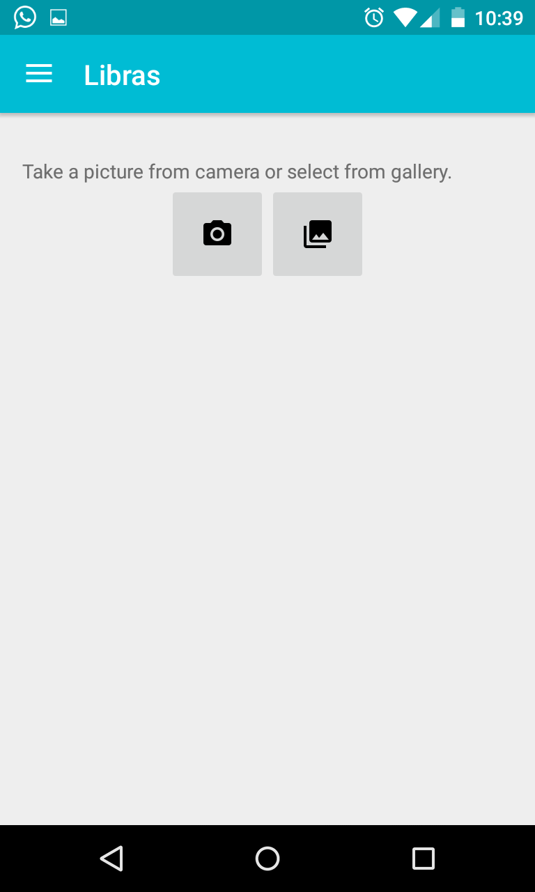
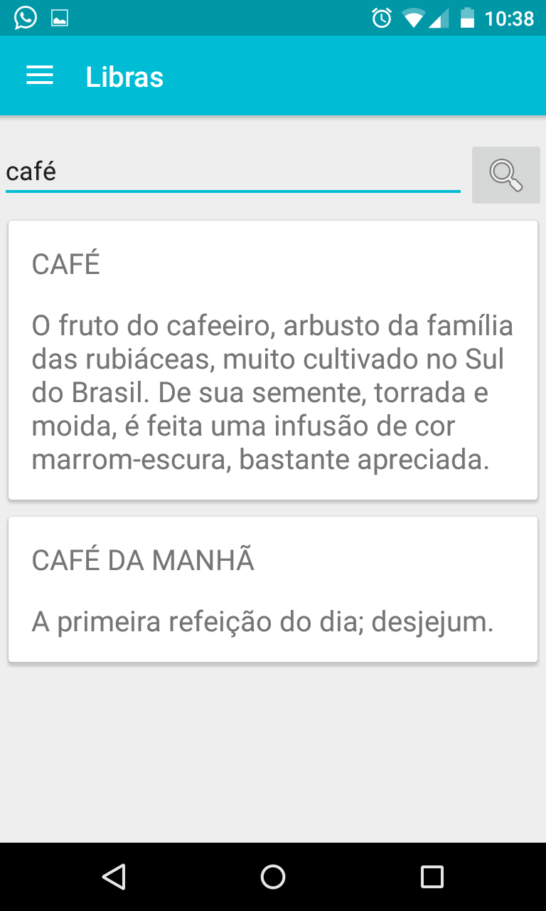
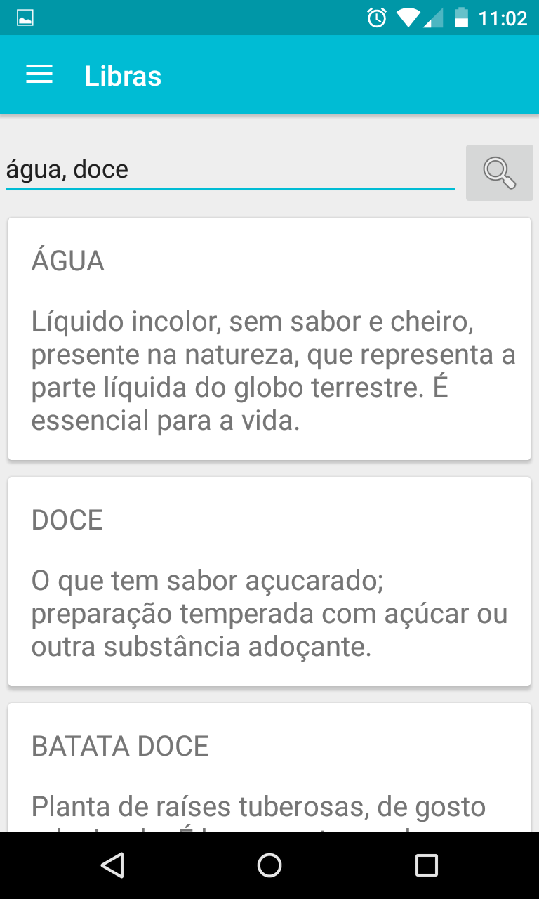
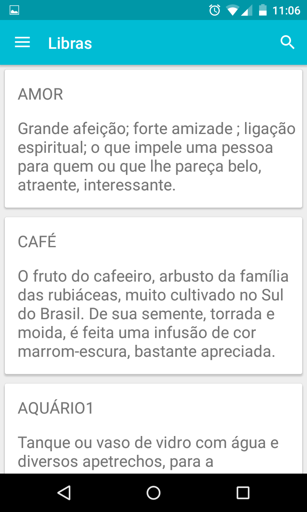

# x2libras android

Follow the instructions bellow to get Libras Android application running.

### Latest build
[x2Libras apk][apk_url]


### Checkout code

1. Clone the repository with:

    ```sh
    $ git clone https://github.com/osnircunha/x2libras.git
    ```

1. Install [Android Studio][android_sdk]

1. On Android Studio select `Open an existing Android Studio project` and open `android` folder from git repository.


By default it is using the Bluemix instance of x2libras backend. You can set up and run the backend locally by following [Set up back end instructions][backend_readme] and change the host on `Constants.java` class.

```java
package com.ocunha.librasapp.utils;

public class Constants {
    private static final String BASE_URL = "http://localhost:3000/api";
...
```

### Application usage

You can see the menu options by sliding the navigation menu on left:

![Navigation Menu](screenshots/menu.png" width="394px" height="640px">

##### Image recognize
Use this menu option to find a LIBRAS word based on a picture. You can select a picture from gallery or take a new one using device camera.



##### Word search
Type a word or a list of word comma separated:




##### Search history
List the word view history:



> For any of the functions above you can just touch the word from result list to see the LIBRAS video and some details such as word definition and sample usage.


[android_sdk]: http://developer.android.com/sdk/index.html
[backend_readme]: https://github.com/osnircunha/x2libras/blob/master/nodejs_backend/README.md
[apk_url]: http://ec2-54-201-148-54.us-west-2.compute.amazonaws.com/jenkins/job/x2libras/lastSuccessfulBuild/artifact/android/app/build/outputs/apk/app-debug.apk
